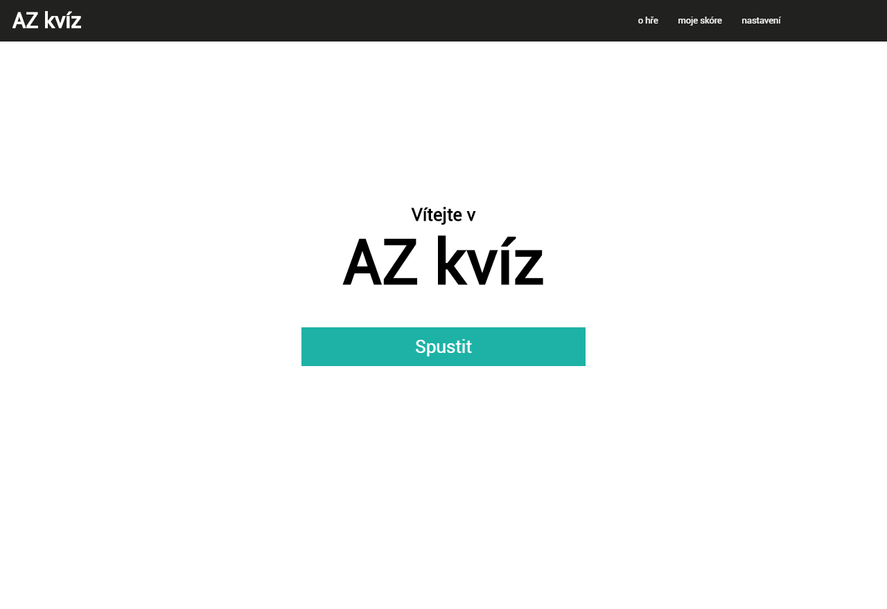
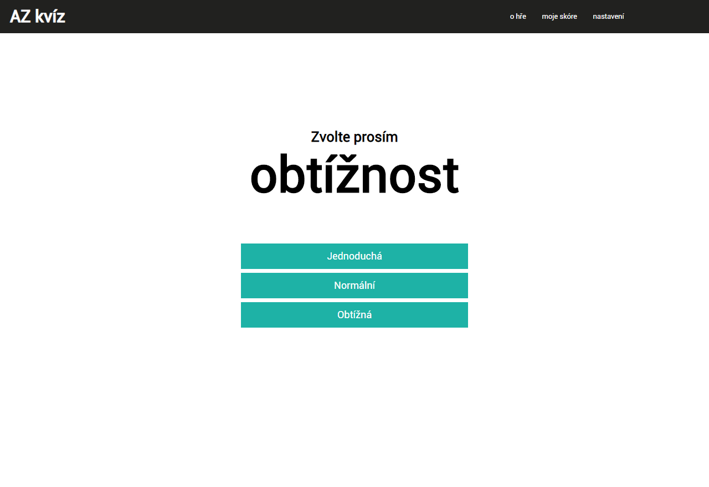
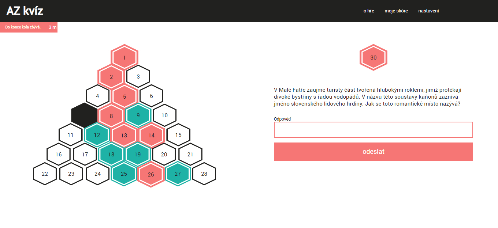
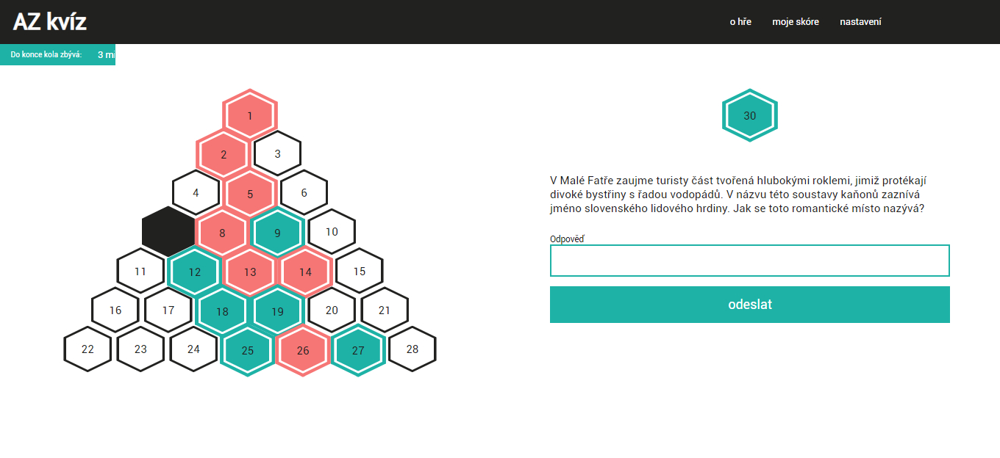
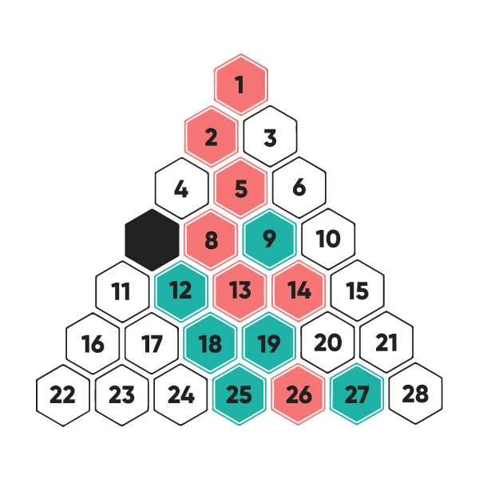

# AZ KVÍZ

Jedná se o obdobu vědomostní a strategické soutěže, která je Českou televizí vysílána na televizních obrazovkách od roku 1997. Skrze web České televize si je možné tuto hru v jednodušším provedení zahrát – [zahrajte si AZ KVÍZ](https://www.ceskatelevize.cz/porady/1097147804-az-kviz/3044-zahrajte-si/).

## Účel hry

Soutěží proti sobě přesně **dva hráči**, kteří se vzájemně střídají ve svých tazích. Jejich úkolem je porazit svého protihráče tím, že za dobu jednoho herního kola správně odpoví na více položených otázek, než jejich protivník. Po uplynutí času jednoho kola bude počet bodů sečtený a za vítěze označen hráč s více body.

## Pravidla hry

- O tom, kdo začne hru v první kole začne, rozhoduje los.
- Jako herní doba jednoho kola byl stanoven čas **4 minut 30 vteřin**.
- Ve chvíli, kdy je soutěžícímu sdělena otázka, má **30 vteřin na její odpověd**. Pokud neodpoví, je to považováno jako odpověď chybná. 
- Za správnou otázku je soutěžícímu přidělen jeden bod a zaplněno jedno herní pole s otázkou, na niž správně odpověděl. Toto pole není možné znovu vybrat jím ani protihráčem a odpovídat na otázku znovu. 
- Pakliže soutěžící po vybrání pole odpoví na otázku chybně, možnost odpovědi bude nabídnuta jeho protihráči. Pokud protihráč odpoví správně, tak získá pole i přidělený bod pro sebe, v opačném případě (chybná odpověď) ani on pole nezíská. Pole se tak stane neaktivním a není již možné se k němu vracet. 

## Struktura

Struktura hry bude následující:
- uvítání
- výběr obtížnosti
- hra
- vyhodnocení

### Uvítací (uvodní) stránka

Jedná se o stránku, která bude zobrazena ve chvíli příchodu návštěvníka do webové aplikace. Návštěvník potvrdí vstup do této hry a je přesměrován na výběr obtížnosti. 

### Výběr obtížnosti

V této části návštěvník volí obtížnost hry. Na výběr jsou **3 obtížnosti – jednoduchá, normální, obtížná**. Každá obtížnost se liší náročností odpovědí na otázky. V jednoduché variantě hry jsou soutěžícímu předkládány jednoduché otázky, hra je tak určena i pro **mladší návštěvníky i dětské publikum**. Střední náročnost poté odpovídá jakési běžné obtížnosti. Varianta obtížné hry je svými otázkami mířena na zkušenější soutěžící, kterým předkládá záludné a náročné otázky.

### Hra

V části hry jsou už skutečně hrací pole, mezi kterými může soutěžící volit. Během hry soutěžící vidí, jaký je jeho zbývající čas do konce kola, odpovědi na otázku i jeho aktuální bodový stav.

#### Hráč 1

#### Hráč 2

### Vyhodnocení 

Soutěžící se v této části dozví svůj výsledek i výsledek svého protihráče. Rovněž jsou mu nabídnuty otázky, na něž odpověděl chybně a správně odpovědi. 

## Vzhled aplikace

### Hra

Herní políčka jsou tvořena hexagony a jsou seskupená tak, aby vytvořily trojúhelník. Mezi těmito políčky soutěžící volí. Pod každým polem je ukryta jedna otázka, na kterou ve chvíli, kdy je soutěžícím pole zvoleno, musí soutěžící odpovědět. Soutěžící volí pole kliknutím. 

Lososová barva (#f67575) zde představuje **hráče 1** s celkem sedmi správnými odpověďmi. Skóre **hráče 2**, který má svá úspěšná pole zabarvená zelenou barvou (#1eb2a6), je 6. Nachází se zde i jedna odpoveď (#212120), na niž ani jedním účastníkem nebylo odpovězeno správně. Pakliže by bylo herní kolo ukončeno a měly být vyhodnoceny výsledky, vítězem by byl hráč 1.

